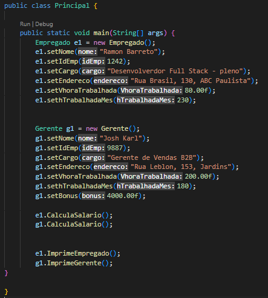

## Código - Sistema de Recursos Humanos 👨🏽‍💼

  

### Java POO ☕

Código desenvolvido como resultado das aulas da faculdade. Esse programa foi elaborado para para representar as funcionalidades de um Sistema de Recursos Humanos empresarial, conseguindo assim me fazer entender ainda mais sobre as características da Programação Orientada a Objetos - Java.

<strong>O programa vai exibir na tela:</strong>

- [x] Nome do empregado
- [x] Seu código/número pessoal
- [x] Cargo que ocupa
- [x] Endereço residencial do funcionário
- [x] Salário do funcionário
  
## Compilação 👨🏽‍💻

### Inserindo dados no sitema 💻⬅

  

## Preview - Funcionários da empresa 🤝🏽

  

## Tecnologias 🛠

- Java POO ☕

## Aluno 👨🏽‍🎓

- <a target="_blank" href="https://www.linkedin.com/in/ramon-barreto-076191180/">Ramon Barreto</a>

## Contato 📲

- Email: ramon_barreto_medrado@hotmail.com

